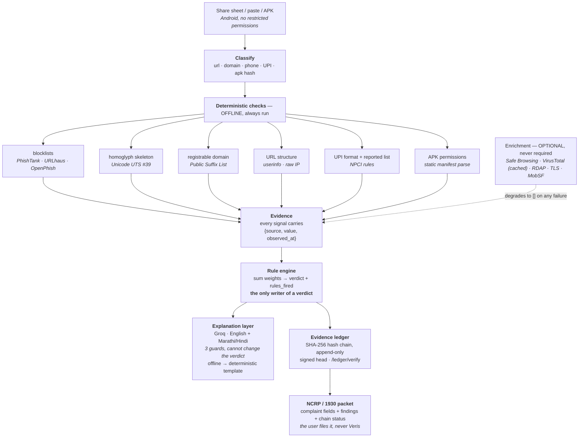

# Veris — architecture

One rule shapes every box below: **the verdict is produced by deterministic
checks against real data sources. The model only explains the evidence.**

## The flow

## Why each boundary exists

**Classify before checking.** Share-sheet input is a whole SMS, not a tidy URL.
Everything downstream depends on extracting the right subject, so it is a
separate, separately-tested step (`app/subject.py`).

**Offline checks are the trunk, not a fallback.** They need no key, no network
and no container, so a verdict is always available — on a village phone, or on
a stage with dead wifi. Enrichment hangs off the side and returns `[]` on any
failure.

**One writer for `verdict`.** `app/rules.py` is the only module that produces
one. It has no model call and no randomness: the same signals always give the
same verdict, and it returns the exact rules that fired.

**The explainer receives a finished result.** By the time `app/explain.py` runs,
the verdict is already decided. `Explanation` has no verdict field, so the
model has nowhere to put one — the rule is enforced by the type, not by
discipline. Two further guards discard prose that contradicts the verdict or
cites a source that produced no signal.

**The ledger is downstream of everything.** It records what was decided, so
tampering with the log cannot change a verdict, only reveal that someone tried.

## Trust boundaries

| Boundary | What crosses it | Guard |
|---|---|---|
| User → engine | raw shared text | classified, never executed; rejected if unclassifiable |
| Engine → LLM | structured evidence **only** | no raw user text, so a scam SMS cannot inject instructions |
| LLM → user | prose | contradiction + invented-source guards; verdict field does not exist |
| Engine → ledger | finished result | append-only, hash-chained, signed head |
| Ledger → complaint | packet | chain status embedded; a broken chain is reported, not hidden |

## Deliberate non-goals

- **No blockchain.** The problem is detecting edits to one evidence log, which
  a hash chain solves completely, offline.
- **No trusted timestamp.** Not implemented, and the packet says so. A
  fabricated time in evidence is worse than none.
- **No auto-filing.** No public NCRP API exists, and filing on someone's behalf
  would be wrong regardless.
- **No `READ_SMS` / `READ_CALL_LOG`.** Play-banned. Share-sheet intake covers
  the demo without them.

## Where the code lives

| Path | Role |
|---|---|
| `app/subject.py` | classify raw input |
| `app/checks.py` | offline deterministic checks |
| `app/apk.py` | APK static analysis |
| `app/enrich.py` | optional network enrichment, cached |
| `app/rules.py` | **the only writer of a verdict** |
| `app/explain.py` | prose, fenced three ways |
| `app/ledger.py` | hash chain + verification |
| `app/packet.py` | NCRP/1930-aligned export |
| `packages/shared/verdict.{py,ts}` | schema, mirrored for the app |
| `fixtures/` | offline seed data |
| `scripts/demo_*.py` | the runnable demos |
